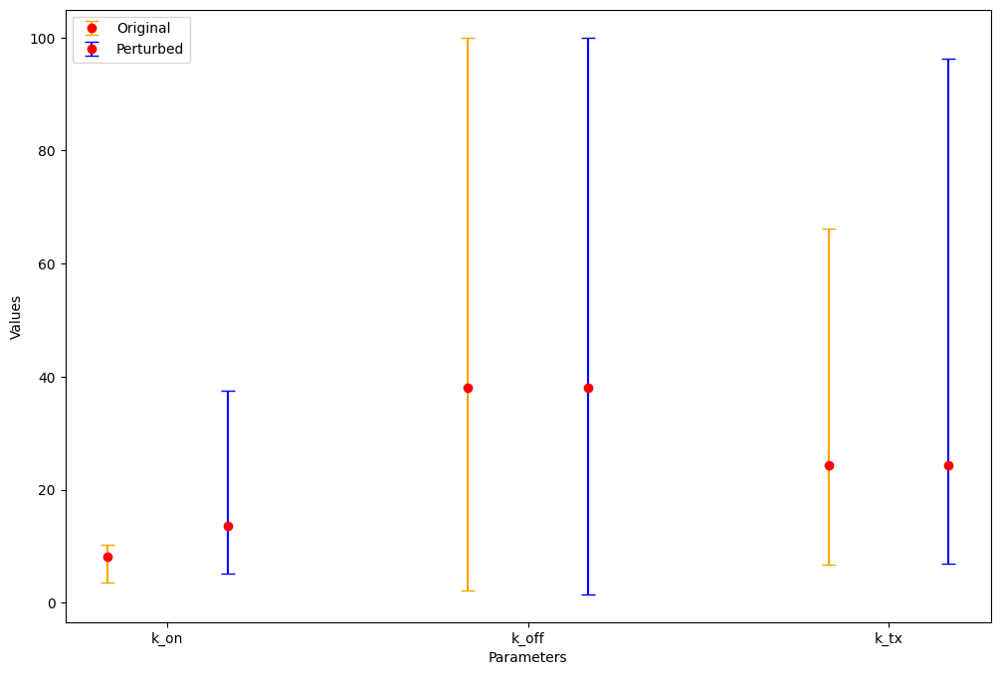

# M5R

Extension of M4R work investigating the application of optimization inference methods to different areas of genomics

# Interaction

## Overview

Genes do not act independently and often interact with other genes, affecting their transcription behaviour. We investigate the problem of detecting if there is interaction between two genes given samples of transcript counts from each.

We first consider the reduced problem of detecting interaction in data simulated from a fixed reaction network:

$$ \varnothing \stackrel{k_{tx, 1}}\longrightarrow X_{1} \qquad \varnothing \stackrel{k_{tx, 2}}\longrightarrow X_{2} $$
$$ X_{1} \stackrel{k_{deg, 1}}\longrightarrow \varnothing \qquad X_{2} \stackrel{k_{deg, 2}}\longrightarrow \varnothing $$
$$ X_{1} + X_{2} \stackrel{k_{reg}}\longrightarrow \varnothing $$

where the genes follow a birth-death model of transcription and interact by regulating each others transcription. The problem of detecting interaction then reduces to determining if the parameter $k_{reg}$ is non-zero: using our optimization based inference method we can produce bounds on the parameter and if they do not include 0 we can conclude that interaction is present.

# Perturbation

## Overview

Experiments often 'perturbe' cells, making changes to the environment such as temperature, applying drugs, etc which can affect how genes are expressed. Using data from 'original' and 'perturbed' sets of cells we want to identify if and how the expression behaviour of different genes changes.

Differential gene expression analysis methods such as the package 'DEseq2' can be use to identify perturbations, producing volcano plots that show the statistical significance (p-value) and magnitude (log fold change) of changes in expression.

We invesitgate the use of optimization based inference to identify perturbations: using a telegraph model of expression we can use non-linear optimization to estimate bounds on model parameters using single-cell data. Applying the method to 'original' and 'perturbed' data for the same gene we compare estimated bounds and conclude if there are statistically significant changes:

In this example the estimated bounds for all parameters overlap suggesting there is not a stat. sig. change in expression behaviour of the gene, a reasonable conclusion given that the true perturbation effect was a slight decrease of the gene's 'on rate'.

## perturbation_simulation.ipynb

To test the performance of methods we simulate syntheic perturbation data. Includes code to produce 'original' and 'perturbed' datasets of transcript counts and parameter values.

For each gene in a dataset:
- sample original model parameters from log-uniform
- sample original transcript counts from telegraph model stationary distribution for each cell (can also sample and apply capture efficiency)
- simulate perturbation effects to produce perturbed model parameters
- sample perturbed transcript counts

## perturbation_identification.ipynb

Code implementing the optimization method to identify perturbation.

For each gene:
- compute bootstrap confidence intervals on distribution of 'original' and 'perturbed' counts using samples
- optimize for each to estimate bounds on model parameters
- disjoint intervals suggest stat. sig. change in parameter value (sig. level according to confidence of bootstrap intervals)

## DESeq2

R script to produce results of DESeq2 perturbation identification to compare

## Plots

Example plots of results from optimization and differential analysis methods

## Simulated data

Example of datasets simulated using 'perturbation_simulation.ipynb'
